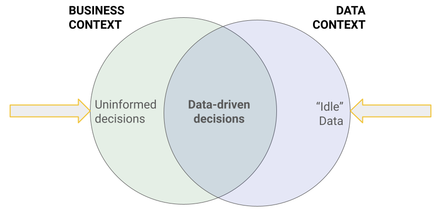
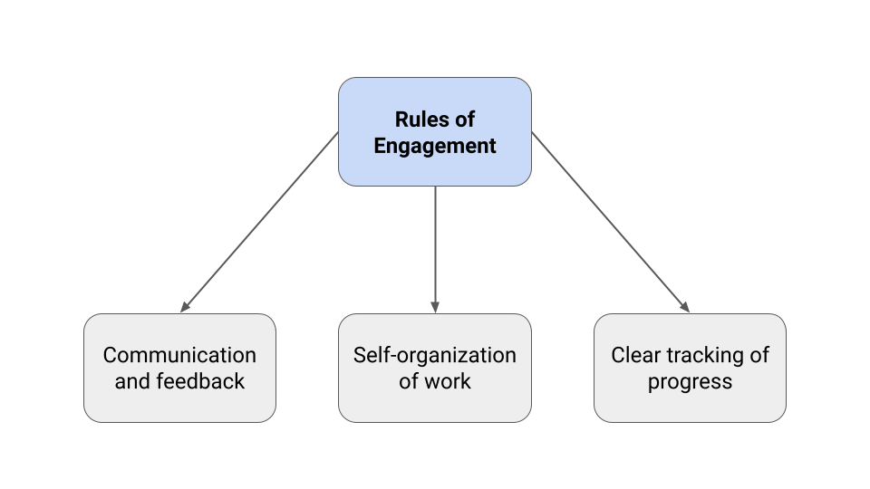

# Team Project
```
$ echo "Data Sciences Institute"
```

---

## Yesterday

1. Team Project guidelines

2. Developing a project idea

3. Git review

---

### Goal

___Develop a program that uses data creatively to solve a problem or provide insights that have a positive business impact.___

---

### Learning Outcomes

1. Resolve merge conflicts.

2. Describe common problems or challenges a team encounters when working collaboratively using Git and GitHub.

3. Create a program to analyze a dataset with contributions from multiple team members.

---

### See repository for requirements.

---

# Developing a project idea

---

 

---
## Developing a project plan

1. Understand the business context.

2. Identify an opportunity.

3. Develop your analysis.

4. Present your results.

---

## Developing a project plan

**Check:** are your insights actionable?

**Check:** how robust is your analysis?

**Check:** what are the caveats or unknowns?

---

### See repository for detailed requirements.

---

## Today

1. Rules of engagement and strategies for effective teamwork

2. Presenting your work and sharing it with others

---

### Think about: how did yesterday go?

Do you think your team functioned well?

What could be improved?

Would the others on your team agree with you?

---

## Rules of engagement

* Every time will land on slight different rules of engagement!

* The key is to be aware of what works and what doesn't, and adjust accordingly.

---

## Rules of engagement

* However, **rules must be explicit**.

* Miscommunication happens when rules are left up to individual interpretation.

---

## Rules of engagement

### Successful teams:

1. Have strong communication.

2. Have a clear undertanding of everyone's role on the team.

3. Work collaboratively towards a common goal.

---

 

---
## Communication and feedback

1. **Feedback as a habit**. A feedback framework helps teams focus on improving processes instead of laying blame.

2. **Respectful and honest communication**. 


---

## A self-organizing team

1. **Clear accountability and ownership of tasks**. Every action item should have someone assigned. Of course, the assigned person can change if workloads become unbalanced.

2. **Be solution-oriented**. Instead of only presenting problems, try to always suggest a possible solution along with a problem.

---

## Clear tracking of progress

1. **Detailed tracking of roadblocks**. It is just as important to communicate roadblocks and failures as successes. The faster problems are identified, the faster they can be addressed.
2. **Use software and/or documentation to help track tasks**.


--- 

## Prioritization

 

--- 

## Prioritization

 

---

# Presenting your work

---

## 1. Understand your target audience

* What knowledge do they have about your project?

* Provide the necessary context.

* Reinforce the insights that __they__ can act on.

--- 

## 1. Understand your target audience

**Example:** We are presenting our analysis of office space usage to the department heads who assign seating. They are not technical, but understand the problem and are looking for a solution. Furthermore, they have their own prior perspectives on office space utilization.

--- 

## 2. Clearly articulate the takeaways

* Make sure your audience understands the most important information.

* Don't add unnecessary detail, but be prepared to speak in depth if asked.

---

## 2. Clearly articulate the takeaways

**Example:** Our company could reduce real estate overhead, while maintaining productivity and employee comfort, if we removed the assigned seating for 10% of teams but updated 25% of our office space to be flexible seating.

---

## 3. Highlight the value added

* Quantify as much as possible.

* Indicate how your work improves over previous work or the status quo.

---

## 3. Highlight the value added

**Example:** Updating the office spaces would add 5% to our real estate costs over the next year, but would save 10% per year once the new seating is implemented.